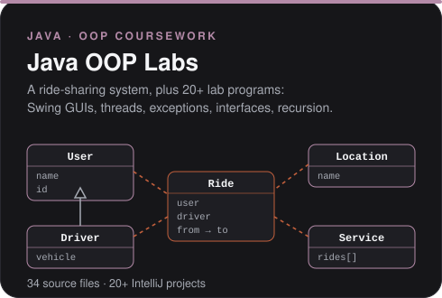
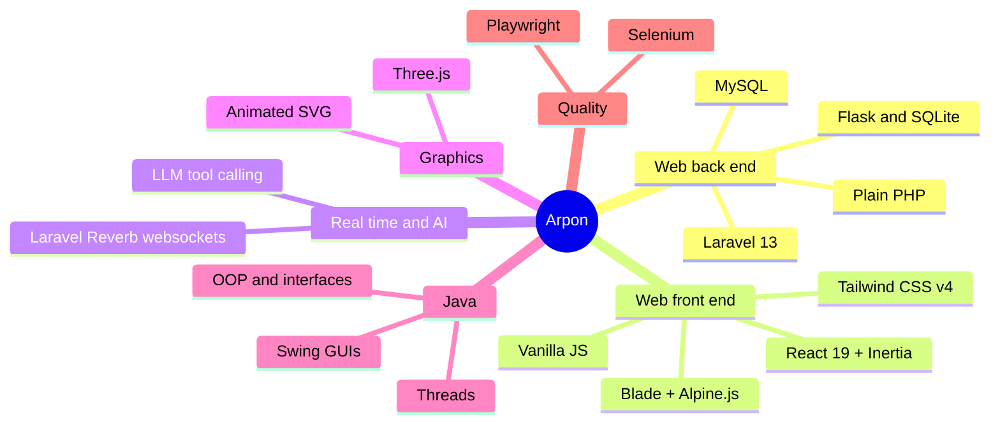
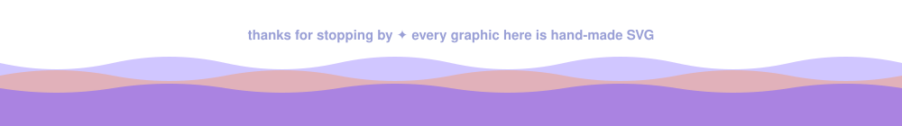

<!-- Profile README for shuaib0606-bit. Every graphic is a hand-made SVG in /assets;
     the skyline and stats in /assets/generated are redrawn daily by .github/workflows/profile.yml -->

<picture>
  <source media="(prefers-color-scheme: dark)" srcset="assets/header-dark.svg">
  <source media="(prefers-color-scheme: light)" srcset="assets/header-light.svg">
  
</picture>

 

  

## 🗂️ Projects

<a href="https://github.com/shuaib0606-bit/uiu-campusconnect">
  <picture>
    <source media="(prefers-color-scheme: dark)" srcset="assets/project-dark.svg">
    <source media="(prefers-color-scheme: light)" srcset="assets/project-light.svg">
    
  </picture>
</a>

<b>What's inside CampusConnect</b>

 

| | |
|---|---|
| **Four roles** | Student, faculty, the Registrar's Office and a master admin, each with their own view of the campus |
| **Class groups from enrolment** | Every course section becomes a group with its teacher, classmates, materials, assignments and live class chat |
| **Controlled reach** | Students apply to contact faculty; an admin approves before messages and mentions open up |
| **Campus assistant** | An AI that answers from the asking student's own classes and deadlines, and nothing else |
| **3D landing page** | The UIU campus modelled in Three.js, with day and night |
| **Tested** | 627 automated Selenium checks across all four roles, all passing |

 

<picture>
  <source media="(prefers-color-scheme: dark)" srcset="assets/genz-dark.svg">
  <source media="(prefers-color-scheme: light)" srcset="assets/genz-light.svg">
  
</picture>

  <picture>
    <source media="(prefers-color-scheme: dark)" srcset="assets/crud-dark.svg">
    <source media="(prefers-color-scheme: light)" srcset="assets/crud-light.svg">
    
  </picture>
  <picture>
    <source media="(prefers-color-scheme: dark)" srcset="assets/java-dark.svg">
    <source media="(prefers-color-scheme: light)" srcset="assets/java-light.svg">
    
  </picture>

 

## 🧭 How I build

## 🏙️ Contributions, as a city

<picture>
  <source media="(prefers-color-scheme: dark)" srcset="assets/generated/skyline-dark.svg">
  <source media="(prefers-color-scheme: light)" srcset="assets/generated/skyline-light.svg">
  
</picture>

<picture>
  <source media="(prefers-color-scheme: dark)" srcset="assets/generated/stats-dark.svg">
  <source media="(prefers-color-scheme: light)" srcset="assets/generated/stats-light.svg">
  
</picture>

Redrawn every day by a GitHub Action from my own contribution data. No third-party widgets.

<picture>
  <source media="(prefers-color-scheme: dark)" srcset="assets/footer-dark.svg">
  <source media="(prefers-color-scheme: light)" srcset="assets/footer-light.svg">
  
</picture>
