<!-- Profile README for shuaib0606-bit. Every graphic is a hand-made SVG in /assets;
     the skyline and stats in /assets/generated are redrawn daily by .github/workflows/profile.yml.
     Each picture has a phone version (-mobile), shown when the window is 700 px wide or less. -->

<picture>
  <source media="(max-width: 700px) and (prefers-color-scheme: dark)" srcset="assets/header-mobile-dark.svg">
  <source media="(max-width: 700px)" srcset="assets/header-mobile-light.svg">
  <source media="(prefers-color-scheme: dark)" srcset="assets/header-dark.svg">
  
</picture>

 

<picture>
  <source media="(max-width: 700px) and (prefers-color-scheme: dark)" srcset="assets/terminal-mobile-dark.svg">
  <source media="(max-width: 700px)" srcset="assets/terminal-mobile-light.svg">
  <source media="(prefers-color-scheme: dark)" srcset="assets/terminal-dark.svg">
  
</picture>

  

##  Tech I work with

###  Languages

<picture><source media="(max-width: 700px) and (prefers-color-scheme: dark)" srcset="assets/skills/php-mobile-dark.svg"><source media="(max-width: 700px)" srcset="assets/skills/php-mobile-light.svg"><source media="(prefers-color-scheme: dark)" srcset="assets/skills/php-dark.svg">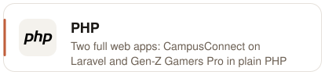</picture><picture><source media="(max-width: 700px) and (prefers-color-scheme: dark)" srcset="assets/skills/javascript-mobile-dark.svg"><source media="(max-width: 700px)" srcset="assets/skills/javascript-mobile-light.svg"><source media="(prefers-color-scheme: dark)" srcset="assets/skills/javascript-dark.svg">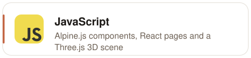</picture><picture><source media="(max-width: 700px) and (prefers-color-scheme: dark)" srcset="assets/skills/python-mobile-dark.svg"><source media="(max-width: 700px)" srcset="assets/skills/python-mobile-light.svg"><source media="(prefers-color-scheme: dark)" srcset="assets/skills/python-dark.svg">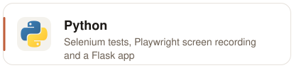</picture><picture><source media="(max-width: 700px) and (prefers-color-scheme: dark)" srcset="assets/skills/java-mobile-dark.svg"><source media="(max-width: 700px)" srcset="assets/skills/java-mobile-light.svg"><source media="(prefers-color-scheme: dark)" srcset="assets/skills/java-dark.svg">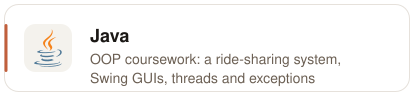</picture>

###  Back end and data

<picture><source media="(max-width: 700px) and (prefers-color-scheme: dark)" srcset="assets/skills/laravel-mobile-dark.svg"><source media="(max-width: 700px)" srcset="assets/skills/laravel-mobile-light.svg"><source media="(prefers-color-scheme: dark)" srcset="assets/skills/laravel-dark.svg">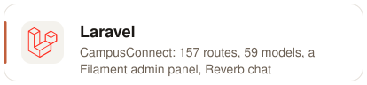</picture><picture><source media="(max-width: 700px) and (prefers-color-scheme: dark)" srcset="assets/skills/mysql-mobile-dark.svg"><source media="(max-width: 700px)" srcset="assets/skills/mysql-mobile-light.svg"><source media="(prefers-color-scheme: dark)" srcset="assets/skills/mysql-dark.svg">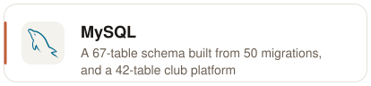</picture><picture><source media="(max-width: 700px) and (prefers-color-scheme: dark)" srcset="assets/skills/sqlite-mobile-dark.svg"><source media="(max-width: 700px)" srcset="assets/skills/sqlite-mobile-light.svg"><source media="(prefers-color-scheme: dark)" srcset="assets/skills/sqlite-dark.svg">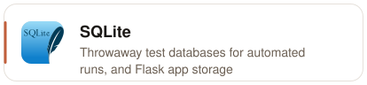</picture><picture><source media="(max-width: 700px) and (prefers-color-scheme: dark)" srcset="assets/skills/flask-mobile-dark.svg"><source media="(max-width: 700px)" srcset="assets/skills/flask-mobile-light.svg"><source media="(prefers-color-scheme: dark)" srcset="assets/skills/flask-dark.svg">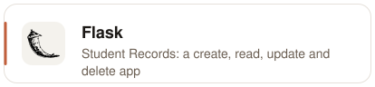</picture>

###  Front end

<picture><source media="(max-width: 700px) and (prefers-color-scheme: dark)" srcset="assets/skills/react-mobile-dark.svg"><source media="(max-width: 700px)" srcset="assets/skills/react-mobile-light.svg"><source media="(prefers-color-scheme: dark)" srcset="assets/skills/react-dark.svg">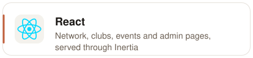</picture><picture><source media="(max-width: 700px) and (prefers-color-scheme: dark)" srcset="assets/skills/alpinejs-mobile-dark.svg"><source media="(max-width: 700px)" srcset="assets/skills/alpinejs-mobile-light.svg"><source media="(prefers-color-scheme: dark)" srcset="assets/skills/alpinejs-dark.svg">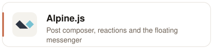</picture><picture><source media="(max-width: 700px) and (prefers-color-scheme: dark)" srcset="assets/skills/tailwindcss-mobile-dark.svg"><source media="(max-width: 700px)" srcset="assets/skills/tailwindcss-mobile-light.svg"><source media="(prefers-color-scheme: dark)" srcset="assets/skills/tailwindcss-dark.svg">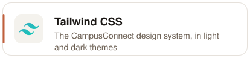</picture><picture><source media="(max-width: 700px) and (prefers-color-scheme: dark)" srcset="assets/skills/threejs-mobile-dark.svg"><source media="(max-width: 700px)" srcset="assets/skills/threejs-mobile-light.svg"><source media="(prefers-color-scheme: dark)" srcset="assets/skills/threejs-dark.svg">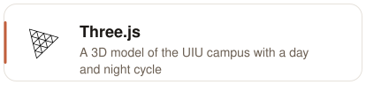</picture><picture><source media="(max-width: 700px) and (prefers-color-scheme: dark)" srcset="assets/skills/html-mobile-dark.svg"><source media="(max-width: 700px)" srcset="assets/skills/html-mobile-light.svg"><source media="(prefers-color-scheme: dark)" srcset="assets/skills/html-dark.svg">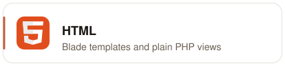</picture><picture><source media="(max-width: 700px) and (prefers-color-scheme: dark)" srcset="assets/skills/css-mobile-dark.svg"><source media="(max-width: 700px)" srcset="assets/skills/css-mobile-light.svg"><source media="(prefers-color-scheme: dark)" srcset="assets/skills/css-dark.svg">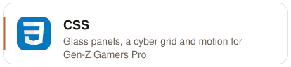</picture><picture><source media="(max-width: 700px) and (prefers-color-scheme: dark)" srcset="assets/skills/vite-mobile-dark.svg"><source media="(max-width: 700px)" srcset="assets/skills/vite-mobile-light.svg"><source media="(prefers-color-scheme: dark)" srcset="assets/skills/vite-dark.svg">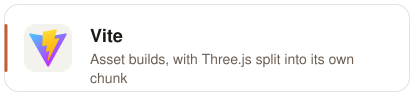</picture><picture><source media="(max-width: 700px) and (prefers-color-scheme: dark)" srcset="assets/skills/svg-mobile-dark.svg"><source media="(max-width: 700px)" srcset="assets/skills/svg-mobile-light.svg"><source media="(prefers-color-scheme: dark)" srcset="assets/skills/svg-dark.svg">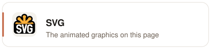</picture>

###  Testing and tools

<picture><source media="(max-width: 700px) and (prefers-color-scheme: dark)" srcset="assets/skills/selenium-mobile-dark.svg"><source media="(max-width: 700px)" srcset="assets/skills/selenium-mobile-light.svg"><source media="(prefers-color-scheme: dark)" srcset="assets/skills/selenium-dark.svg">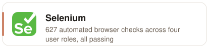</picture><picture><source media="(max-width: 700px) and (prefers-color-scheme: dark)" srcset="assets/skills/git-mobile-dark.svg"><source media="(max-width: 700px)" srcset="assets/skills/git-mobile-light.svg"><source media="(prefers-color-scheme: dark)" srcset="assets/skills/git-dark.svg">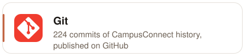</picture><picture><source media="(max-width: 700px) and (prefers-color-scheme: dark)" srcset="assets/skills/githubactions-mobile-dark.svg"><source media="(max-width: 700px)" srcset="assets/skills/githubactions-mobile-light.svg"><source media="(prefers-color-scheme: dark)" srcset="assets/skills/githubactions-dark.svg">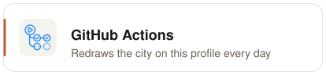</picture><picture><source media="(max-width: 700px) and (prefers-color-scheme: dark)" srcset="assets/skills/cloudflare-mobile-dark.svg"><source media="(max-width: 700px)" srcset="assets/skills/cloudflare-mobile-light.svg"><source media="(prefers-color-scheme: dark)" srcset="assets/skills/cloudflare-dark.svg">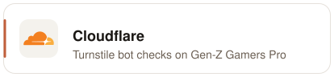</picture><picture><source media="(max-width: 700px) and (prefers-color-scheme: dark)" srcset="assets/skills/vscode-mobile-dark.svg"><source media="(max-width: 700px)" srcset="assets/skills/vscode-mobile-light.svg"><source media="(prefers-color-scheme: dark)" srcset="assets/skills/vscode-dark.svg"></picture><picture><source media="(max-width: 700px) and (prefers-color-scheme: dark)" srcset="assets/skills/idea-mobile-dark.svg"><source media="(max-width: 700px)" srcset="assets/skills/idea-mobile-light.svg"><source media="(prefers-color-scheme: dark)" srcset="assets/skills/idea-dark.svg">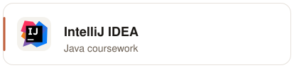</picture>

##  Contributions, as a city

<picture>
  <source media="(max-width: 700px) and (prefers-color-scheme: dark)" srcset="assets/generated/skyline-mobile-dark.svg">
  <source media="(max-width: 700px)" srcset="assets/generated/skyline-mobile-light.svg">
  <source media="(prefers-color-scheme: dark)" srcset="assets/generated/skyline-dark.svg">
  
</picture>

<picture>
  <source media="(max-width: 700px) and (prefers-color-scheme: dark)" srcset="assets/generated/stats-mobile-dark.svg">
  <source media="(max-width: 700px)" srcset="assets/generated/stats-mobile-light.svg">
  <source media="(prefers-color-scheme: dark)" srcset="assets/generated/stats-dark.svg">
  
</picture>

Redrawn every day by a GitHub Action from my own contribution data.

<picture>
  <source media="(max-width: 700px) and (prefers-color-scheme: dark)" srcset="assets/footer-mobile-dark.svg">
  <source media="(max-width: 700px)" srcset="assets/footer-mobile-light.svg">
  <source media="(prefers-color-scheme: dark)" srcset="assets/footer-dark.svg">
  
</picture>
