<!-- Profile README for shuaib0606-bit. Every graphic is a hand-made SVG in /assets;
     the skyline and stats in /assets/generated are redrawn daily by .github/workflows/profile.yml -->

<picture>
  <source media="(prefers-color-scheme: dark)" srcset="assets/header-dark.svg">
  <source media="(prefers-color-scheme: light)" srcset="assets/header-light.svg">
  
</picture>

 

<picture>
  <source media="(prefers-color-scheme: dark)" srcset="assets/terminal-dark.svg">
  <source media="(prefers-color-scheme: light)" srcset="assets/terminal-light.svg">
  
</picture>

  

##  Tech I work with

###  Languages

<table>
  <tr>
    <td width="64" align="center"><picture><source media="(prefers-color-scheme: dark)" srcset="https://api.iconify.design/skill-icons/php-dark.svg"></picture></td>
    <td><b>PHP</b> Two full web apps: CampusConnect on Laravel and Gen-Z Gamers Pro in plain PHP</td>
    <td width="64" align="center"></td>
    <td><b>JavaScript</b> Alpine.js components, React pages and a Three.js 3D scene</td>
  </tr>
  <tr>
    <td width="64" align="center"><picture><source media="(prefers-color-scheme: dark)" srcset="https://api.iconify.design/skill-icons/python-dark.svg"></picture></td>
    <td><b>Python</b> Selenium tests, Playwright screen recording and a Flask app</td>
    <td width="64" align="center"><picture><source media="(prefers-color-scheme: dark)" srcset="https://api.iconify.design/skill-icons/java-dark.svg"></picture></td>
    <td><b>Java</b> OOP coursework: a ride-sharing system, Swing GUIs, threads and exceptions</td>
  </tr>
</table>

###  Back end and data

<table>
  <tr>
    <td width="64" align="center"><picture><source media="(prefers-color-scheme: dark)" srcset="https://api.iconify.design/skill-icons/laravel-dark.svg"></picture></td>
    <td><b>Laravel</b> CampusConnect: 157 routes, 59 models, a Filament admin panel and live chat with Reverb</td>
    <td width="64" align="center"><picture><source media="(prefers-color-scheme: dark)" srcset="https://api.iconify.design/skill-icons/mysql-dark.svg"></picture></td>
    <td><b>MySQL</b> A 67-table schema built from 50 migrations, and a 42-table club platform</td>
  </tr>
  <tr>
    <td width="64" align="center"></td>
    <td><b>SQLite</b> Throwaway test databases for automated runs, and Flask app storage</td>
    <td width="64" align="center"><picture><source media="(prefers-color-scheme: dark)" srcset="https://api.iconify.design/skill-icons/flask-dark.svg"></picture></td>
    <td><b>Flask</b> Student Records: a create, read, update and delete app</td>
  </tr>
</table>

###  Front end

<table>
  <tr>
    <td width="64" align="center"><picture><source media="(prefers-color-scheme: dark)" srcset="https://api.iconify.design/skill-icons/react-dark.svg"></picture></td>
    <td><b>React</b> Network, clubs, events and admin pages, served through Inertia</td>
    <td width="64" align="center"><picture><source media="(prefers-color-scheme: dark)" srcset="https://api.iconify.design/skill-icons/alpinejs-dark.svg"></picture></td>
    <td><b>Alpine.js</b> Post composer, reactions and the floating messenger</td>
  </tr>
  <tr>
    <td width="64" align="center"><picture><source media="(prefers-color-scheme: dark)" srcset="https://api.iconify.design/skill-icons/tailwindcss-dark.svg"></picture></td>
    <td><b>Tailwind CSS</b> The CampusConnect design system, in light and dark themes</td>
    <td width="64" align="center"><picture><source media="(prefers-color-scheme: dark)" srcset="https://api.iconify.design/skill-icons/threejs-dark.svg"></picture></td>
    <td><b>Three.js</b> A 3D model of the UIU campus with a day and night cycle</td>
  </tr>
  <tr>
    <td width="64" align="center"></td>
    <td><b>HTML</b> Blade templates and plain PHP views</td>
    <td width="64" align="center"></td>
    <td><b>CSS</b> Glass panels, a cyber grid and motion for Gen-Z Gamers Pro</td>
  </tr>
  <tr>
    <td width="64" align="center"><picture><source media="(prefers-color-scheme: dark)" srcset="https://api.iconify.design/skill-icons/vite-dark.svg"></picture></td>
    <td><b>Vite</b> Asset builds, with Three.js split into its own chunk</td>
    <td width="64" align="center"><picture><source media="(prefers-color-scheme: dark)" srcset="https://api.iconify.design/skill-icons/svg-dark.svg"></picture></td>
    <td><b>SVG</b> The animated graphics on this page</td>
  </tr>
</table>

###  Testing and tools

<table>
  <tr>
    <td width="64" align="center"></td>
    <td><b>Selenium</b> 627 automated browser checks across four user roles, all passing</td>
    <td width="64" align="center"></td>
    <td><b>Git</b> 223 commits of CampusConnect history</td>
  </tr>
  <tr>
    <td width="64" align="center"><picture><source media="(prefers-color-scheme: dark)" srcset="https://api.iconify.design/skill-icons/githubactions-dark.svg"></picture></td>
    <td><b>GitHub Actions</b> Redraws the city on this profile every day</td>
    <td width="64" align="center"><picture><source media="(prefers-color-scheme: dark)" srcset="https://api.iconify.design/skill-icons/cloudflare-dark.svg"></picture></td>
    <td><b>Cloudflare</b> Turnstile bot checks on Gen-Z Gamers Pro</td>
  </tr>
  <tr>
    <td width="64" align="center"><picture><source media="(prefers-color-scheme: dark)" srcset="https://api.iconify.design/skill-icons/vscode-dark.svg"></picture></td>
    <td><b>VS Code</b> Everyday editor</td>
    <td width="64" align="center"><picture><source media="(prefers-color-scheme: dark)" srcset="https://api.iconify.design/skill-icons/idea-dark.svg"></picture></td>
    <td><b>IntelliJ IDEA</b> Java coursework</td>
  </tr>
</table>

##  Contributions, as a city

<picture>
  <source media="(prefers-color-scheme: dark)" srcset="assets/generated/skyline-dark.svg">
  <source media="(prefers-color-scheme: light)" srcset="assets/generated/skyline-light.svg">
  
</picture>

<picture>
  <source media="(prefers-color-scheme: dark)" srcset="assets/generated/stats-dark.svg">
  <source media="(prefers-color-scheme: light)" srcset="assets/generated/stats-light.svg">
  
</picture>

Redrawn every day by a GitHub Action from my own contribution data.

<picture>
  <source media="(prefers-color-scheme: dark)" srcset="assets/footer-dark.svg">
  <source media="(prefers-color-scheme: light)" srcset="assets/footer-light.svg">
  
</picture>
