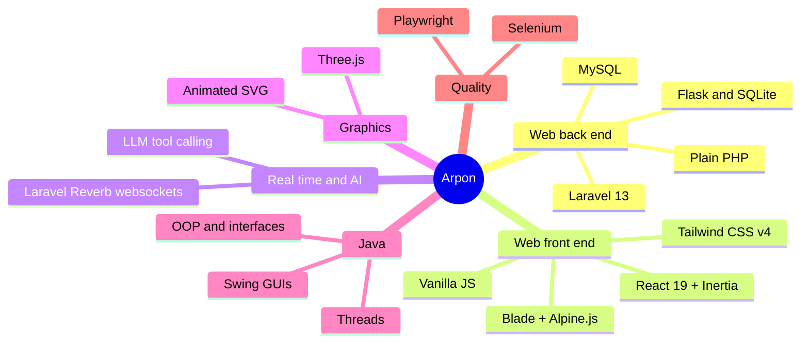

<!-- Profile README for shuaib0606-bit. Every graphic is a hand-made SVG in /assets;
     the skyline and stats in /assets/generated are redrawn daily by .github/workflows/profile.yml -->

<picture>
  <source media="(prefers-color-scheme: dark)" srcset="assets/header-dark.svg">
  <source media="(prefers-color-scheme: light)" srcset="assets/header-light.svg">
  
</picture>

 

  

## 🧭 How I build

## 🏙️ Contributions, as a city

<picture>
  <source media="(prefers-color-scheme: dark)" srcset="assets/generated/skyline-dark.svg">
  <source media="(prefers-color-scheme: light)" srcset="assets/generated/skyline-light.svg">
  
</picture>

<picture>
  <source media="(prefers-color-scheme: dark)" srcset="assets/generated/stats-dark.svg">
  <source media="(prefers-color-scheme: light)" srcset="assets/generated/stats-light.svg">
  
</picture>

Redrawn every day by a GitHub Action from my own contribution data. No third-party widgets.

<picture>
  <source media="(prefers-color-scheme: dark)" srcset="assets/footer-dark.svg">
  <source media="(prefers-color-scheme: light)" srcset="assets/footer-light.svg">
  
</picture>
